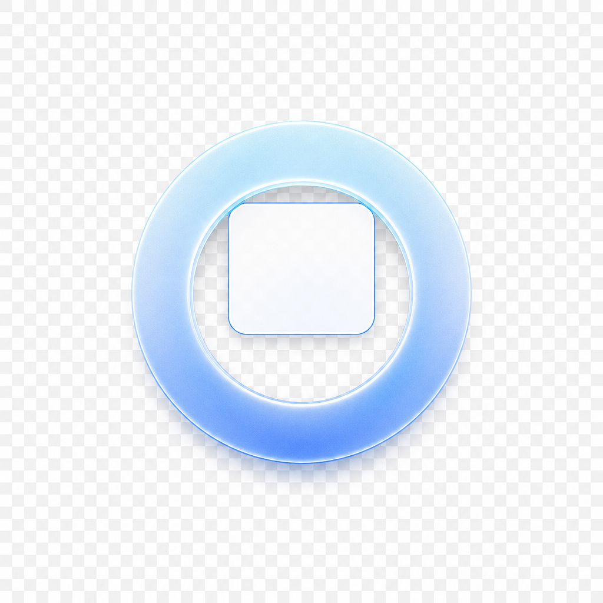

<p align="center">
  
</p>

### Ring

按住左 Alt，鼠标滑向目标方向，窗口自动吸附到位。不用拖标题栏，不用记快捷键。

<p align="center">
  
  
  
</p>

<!-- TODO: 替换为演示 GIF -->
<!-- <p align="center"></p> -->

---

## 这是什么

Ring 是一个 Windows 窗口管理小工具。按住左 Alt，屏幕上出现圆环浮层，鼠标滑向哪个方向，当前窗口就吸附到屏幕的对应位置——半屏、三分屏、角落、居中浮窗、最大化，松手即定位。多显示器自动适配。

14 种布局覆盖日常窗口排列需求，动画用弹簧物理驱动，跟手不跳帧。

---

## 下载

从 [Releases](https://github.com/iiishop/Ring/releases) 获取最新版本：

- **便携版** `Ring-portable-v*.zip` — 解压即用，不需要安装
- **安装版** `Ring-v*-Setup.exe` — 标准安装包，附带开始菜单快捷方式

首次运行会请求管理员权限（窗口操作需要），之后最小化到系统托盘，右键图标可退出。

---

## 使用方式

按住**左 Alt**，圆环出现。用鼠标选择方向：

| 方向 | 布局 |
|------|------|
| 上 / 下 / 左 / 右 | 半屏 |
| 左上 / 右上 / 左下 / 右下 | 四分之一屏 |
| 左 / 右拉得更远 | 1/3 或 2/3 宽度 |
| 上下方向拉远 | 居中 1/3 宽度 |
| 居中短距离 | 最大化 |
| 居中稍远 | 居中浮窗 |

松开 Alt 即生效。

**Alt 组合键不会误触。** 只有单独按下左 Alt 时 Ring 才激活，Alt+Tab 等正常使用不受影响。

---

## 配置触发键

默认触发键为**左 Alt**。如需更换，可在项目根目录的 `config.json` 中配置 `trigger` 字段：

```json
{"trigger":"alt_l"}
```

`trigger` 支持两种形式：

- **pynput 常用特殊键名称**：如 `alt_l`、`alt_r`、`ctrl_l`、`ctrl_r`、`shift_l`、`shift_r`、`space`、`enter`、`tab`、`esc`、`backspace`、`caps_lock` 等
- **普通单字符键**：如 `"a"`、`"b"`、`"1"` 等

例如配置为普通按键 `a`：

```json
{"trigger":"a"}
```

> 修改 `config.json` 后需**重启程序**才能生效。若配置文件缺失、内容无效或 `trigger` 值不受支持，程序会安全回退到默认的左 Alt 并输出提示。

---

## 特性

- 14 种窗口布局，覆盖半屏、三分屏、角落、浮窗、最大化
- 多显示器自动识别工作区，鼠标在哪就吸附到哪个屏幕
- 弹簧物理动画，颜色和形状过渡自然，切换方向不跳帧
- 单独按下左 Alt 才触发，Alt+Tab 等组合键不受影响
- 单文件便携版，解压即用

---

## 构建

```bash
git clone https://github.com/iiishop/Ring.git
cd Ring
pip install pyside6 pynput pygetwindow pyinstaller
pyinstaller Ring.spec
# 输出: dist/Ring.exe
```

---

## 许可

MIT
